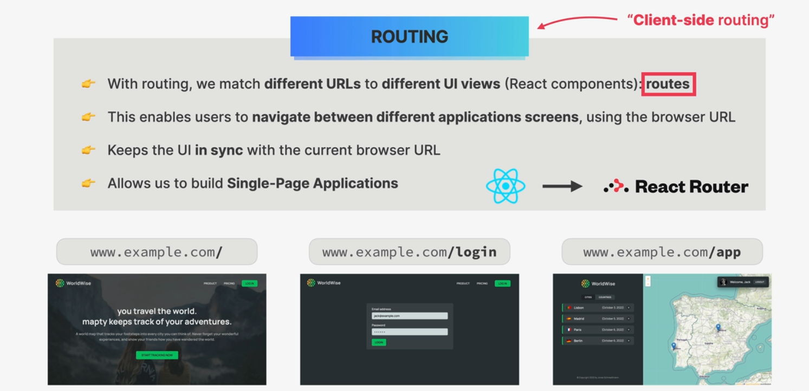
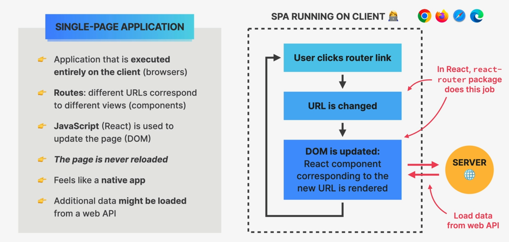
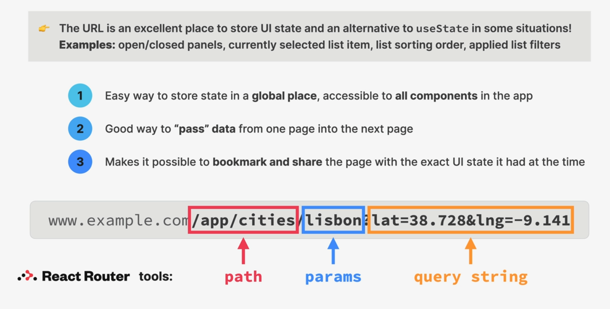
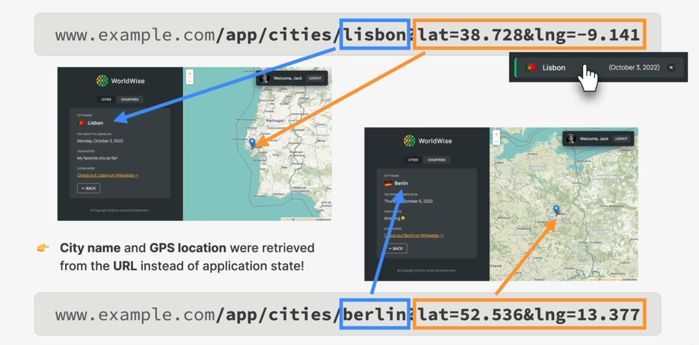

# React Router Implementation Guide

## React Routing



### Basic Router Setup

```jsx
// Root router setup example from App.jsx
<BrowserRouter>
  <Routes>
    <Route index element={<Homepage />} />
    <Route path="product" element={<Product />} />
    <Route path="app" element={<AppLayout />}>
      {/* Nested routes */}
      <Route index element={<Navigate replace to="cities" />} />
      <Route path="cities" element={<CityList />} />
    </Route>
  </Routes>
</BrowserRouter>
```

### Navigation Components

1. **Link Component**: Basic navigation

```jsx
// Example from Homepage.jsx
<Link to="/app" className="cta">
  Start tracking now
</Link>
```

2. **NavLink Component**: Navigation with active state

```jsx
// Example from PageNav.jsx
<NavLink to="/pricing">Pricing</NavLink>
```

### Route Parameters and Query Strings

1. **URL Parameters**:

```jsx
// Example from App.jsx
<Route path="cities/:Id" element={<City />} />;

// Accessing params in City.jsx
const { Id } = useParams();
```

2. **Query Parameters**:

```jsx
// Example from Map.jsx
const [searchParams, setSearchParams] = useSearchParams();
const lat = searchParams.get("lat");
const lng = searchParams.get("lng");
```

### Nested Routes with Outlet

Nested routes allow for complex layouts with shared UI elements:

```jsx
// Example from Sidebar.jsx
<div className={styles.sidebar}>
  <Logo />
  <AppNav />
  <Outlet /> {/* Child routes render here */}
</div>
```

### Programmatic Navigation

Using `useNavigate` hook for programmatic navigation:

```jsx
// Example from Form.jsx
const navigate = useNavigate();
// Navigate back
navigate(-1);
```

## SPA (Single Page Application)



Single Page Applications use client-side routing to render different views without full page reloads.

## URL for State Management



Using URLs for state management helps with:

- Bookmarking
- Sharing links
- Browser history
- SEO

### Params & Query String



- **URL Parameters**: Used for essential data (e.g., IDs)
- **Query Strings**: Used for optional data (e.g., filters, coordinates)

### Best Practices

1. Use nested routes for related views
2. Implement 404 handling with catch-all routes
3. Use NavLink for navigation with active states
4. Keep URLs clean and semantic
5. Use proper route organization
